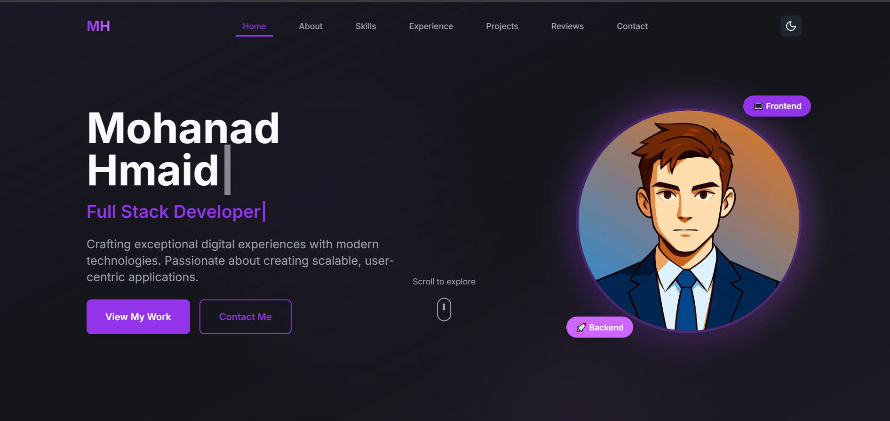
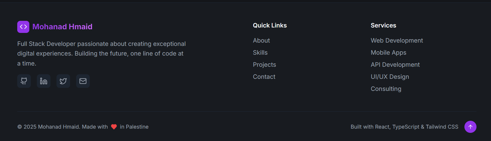

# Mohanad Hmaid's Portfolio

## Overview

The repository contain the code for my personal portfolio website. The website shows my skills, experience, and projects as a Full Stack Developer.

## Features

*   **Modern UI/UX:** Built with a clean and responsive design.
*   **Project Showcase:** Detailed sections for various projects.
*   **Skills & Experience:** Highlights key technical skills and professional experience.
*   **Contact Form:** Easy way for visitors to get in touch.

## Technologies Used

The project is built using the following technologies:

*   **Frontend:** React, TypeScript, Tailwind CSS
*   **Styling:** Tailwind CSS
*   **State Management:** (Based on `package.json`, it seems to use `@tanstack/react-query` and `react-hook-form` for data handling and forms)
*   **UI Components:** Radix UI
*   **Animations:** Framer Motion
*   **3D Graphics:** React Three Fiber, Drei, Three.js

